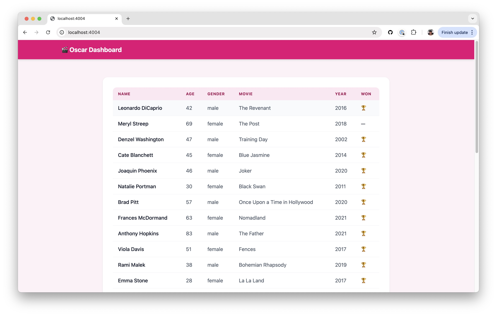

# What is this?
This repository is testing that standard [Elixir Phoenix](https://github.com/inertiajs/inertia-phoenix) keep working as expected after the [introduction of the SSR adapters in this PR](https://github.com/inertiajs/inertia-phoenix/pull/44)

# The app
It's a basic endpoint rendering a React page on SSR


## How to setup development?
After cloning this repo. This asume you have a postgres database running locally (or in a docker container).

```
# Start postgresql db + phoenix app
docker compose up

# Run the migrations
docker compose run web mix ecto.migrate

# Run data migrations
docker compose run web mix ecto.migrate  --migrations-path priv/repo/data_migrations
```

## How to test a production setup?

Build production docker image
```bash
./docker/build-prod.sh
```

Run production docker image
```bash
./docker/run-prod.sh
```

It will fail first time. You need to run migrations and data migrations
```bash
# Pick the docker container id
docker ps

# Enter the container
docker exec -it [CONTAINER_ID] /bin/bash

# Run the release migrations
./bin/migrate

# Run data migrations
./bin/migrate data
```

